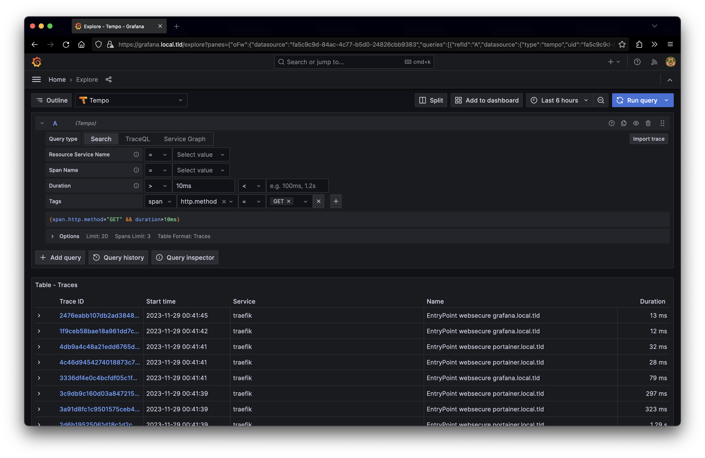

- [OLC (One-Line _Self-Hosting_ Command)](#olc-one-line-self-hosting-command)
  - [Description](#description)
  - [Requirements](#requirements)
      - [A server with a public IP address.](#a-server-with-a-public-ip-address)
      - [A domain name](#a-domain-name)
      - [A DNS provider that supports ACME (Let's Encrypt)](#a-dns-provider-that-supports-acme-lets-encrypt)
      - [Docker and docker-compose installed on the server](#docker-and-docker-compose-installed-on-the-server)
  - [Usage](#usage)
  - [Configuration](#configuration)
  - [Running locally](#running-locally)
  - [Github OAuth for protected services/routes](#github-oauth-for-protected-servicesroutes)
  - [Cloudflare DNS](#cloudflare-dns)
  - [Next steps](#next-steps)
  - [Screenshots](#screenshots)


# OLC (One-Line _Self-Hosting_ Command)


This repository is a collection of scripts and configuration files to setup a self-hosting stack on a single server (or multiple) using `docker swarm` as the main orchestrator with a simple one-line command.

## Description
The stack is composed of the following services:
- [Traefik](https://traefik.io/) as a reverse proxy
- [Portainer](https://www.portainer.io/) as a docker management UI (and service deployment)
- [Docker Registry](https://hub.docker.com/_/registry) to host your **own** docker images and trigger deployments through Github Actions etc.
- [Grafana](https://grafana.com/docs/grafana/latest/setup-grafana/installation/docker/) to monitor the server's resources and logging
- [Loki](https://grafana.com/docs/loki/latest/get-started/overview/) to collect logs from all the services
- [Promtail](https://grafana.com/docs/loki/latest/send-data/promtail/installation/) to act as a log sink for Loki and send logs to Grafana (or other places you define)
- NodeExporter for host metrics (node and manager)
- [Prometheus](https://prometheus.io/docs/prometheus/latest/installation/) to collect metrics from all the services


## Requirements

#### A server with a public IP address. 

Check out [Hetzner](https://www.hetzner.com/), [Contabo](https://contabo.com/en/), [Vultr](https://www.vultr.com/), [DigitalOcean](https://www.digitalocean.com/), [Linode](https://www.linode.com/) for servers within 5 EUR/USD.

#### A domain name
A domain name and the correct DNS records pointing to the server. This is particular to your DNS provider.  Often you can find these settings in the DNS management panel.

* In most cases, you will need to create an `A` record pointing to the server's IP address. [More about it here.](https://www.cloudflare.com/learning/dns/dns-records/dns-a-record/)

* In most cases, you will also need to create a `CNAME` record pointing to the `A` record. [More about it here.](https://www.cloudflare.com/learning/dns/dns-records/dns-cname-record/)

#### A DNS provider that supports ACME (Let's Encrypt)

[ACME](https://en.wikipedia.org/wiki/Automated_Certificate_Management_Environment) (Let's Encrypt)

#### Docker and docker-compose installed on the server 

We will use `docker swarm` to manage the services together. I recommend using the **latest stable** version of docker and docker-compose.

Installation instructions [can be found here for Docker Engine](https://docs.docker.com/engine/install/). 
If you are using `Ubuntu`, you can use the following link: https://docs.docker.com/engine/install/ubuntu/

## Usage

- Clone this repository on the server (or download)
```bash
cd $HOME
git clone https://github.com/luizfonseca/docker-swarm-stack.git

cd ~/docker-swarm-stack
```

- Make sure you have a swarm initialized on the server. If not, run the following command:

```bash
docker swarm init
```

- Make sure to update the `.env` file and then edit it with the correct values
```bash
cp .env.example .env
```  

- Run the following command to start the stack:
```bash
make deploy
```


## Configuration
There isn't much to configure in this stack. However, you can change most of the configuration through the `.env` file. Here is a list of the variables you can change:

```bash
# Some of the tools (like portainer or grafana) are behind an
# oauth proxy server + credentials. You can create apps in the 
# Developer settings of your github account.
GITHUB_OAUTH_CLIENT_ID=YOUR_CLIENT_ID
GITHUB_OAUTH_CLIENT_SECRET=YOUR_SECRET

# Usernames authorized to interact with the admin dashboards
GITHUB_USERNAME=<your-username>

# Domain configuration (used by traefik and letsencrypt)
# Make sure your DNS records are pointing to your server
# You will need DNS A records for 
# - *.<subdomain>.your-domain.com 
# - *.your-domain.com 
# - your-domain.com
DOMAIN_NAME=localhost
DOMAIN_CONTACT=myemail@example.com

# When set, the script
# will generate domain names using the suffix
# So that users can't guess the domain names of your services
# E.g. setting this to "0a1b2", portainer will be available at
# http://portainer-0a1b2.example.com. 
# Same for Grafana and the GH oauth app.
DOMAIN_SUFFIX=""
```


## Running locally

The only difference between running locally and on a server is the `letsencrypt` configuration. We will be targetting the `staging` version of it.

If you want to run it locally, you will need to update your `/etc/hosts` file with the following entry:

```bash
127.0.0.1       traefik.localhost portainer.localhost grafana.localhost registry.localhost gh-auth.localhost
```

Then, you can run the following command to start the stack:

```bash
docker swarm init
make deploy
```

* HTTPs doesn't work locally since we are using a self-signed certificate. You can use `http://{serviceName}.localhost` to access the services, but you will need to accept the self-signed certificate warning.

* Some services are not exposed since they don't offer much, but you can expose them by editing the `docker-compose.yml` file and adding the following to the service you want to expose:

```yaml
... # other configuration

... deploy:
        labels:
            - "trafik.enable=true"
            - "traefik.http.routers.<service_name>.rule=Host(`<service_name>.${DOMAIN_NAME:?err}`)"
            - "traefik.http.routers.<service_name>.entrypoints=websecure"
            - "traefik.http.routers.<service_name>.tls.certresolver=leresolver"
            - "traefik.http.services.<service_name>.loadbalancer.server.port=<container-port>"
```

## Github OAuth for protected services/routes
* You can also make this service require Github authentication by adding the following to the service in addition to the above:

```yaml
... # other configuration
    deploy:
        labels:
            - "traefik.http.middlewares.oauth-proxy.plugin.gh-oauth.apiBaseUrl=http://gh-oauth"
            - "traefik.http.middlewares.oauth-proxy.plugin.gh-oauth.whitelist.logins[0]=${GITHUB_USERNAME}"

            # Attach GH middleware
            - "traefik.http.routers.<service_name>.middlewares=oauth-proxy"
```


## Cloudflare DNS

If for some reason you are using Cloudflare DNS with proxying enabled for your domains, you will need to disable the **proxy first** so that letsencrypt can validate the domain. You can do that by clicking on the orange cloud icon next to the domain name in the DNS management panel.

After emitting the certificates, you can enable the proxy again.


## Next steps

Althoug this is a functional stack, there are a few things that can be improved:

- Dashboards for Grafana, with all the data sources configured
- Dashboards for your logs, traces etc.
- Long term storage for logs (e.g. S3)
- Long term storage for metrics (e.g. Prometheus remote storage)
- Alerting (e.g. Alertmanager)
- Security, IP restrictions and so on.

Long term storage is on the roadmap as soon as dashboards are ready.


## Screenshots


|  |  |
| --- | --- |
 |  | 
 |  |